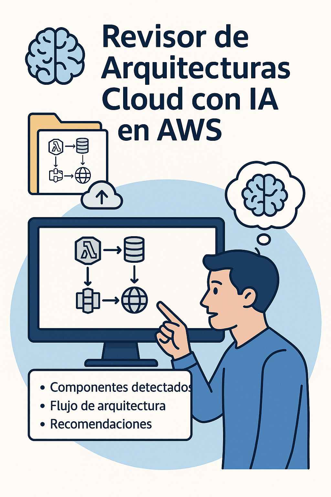
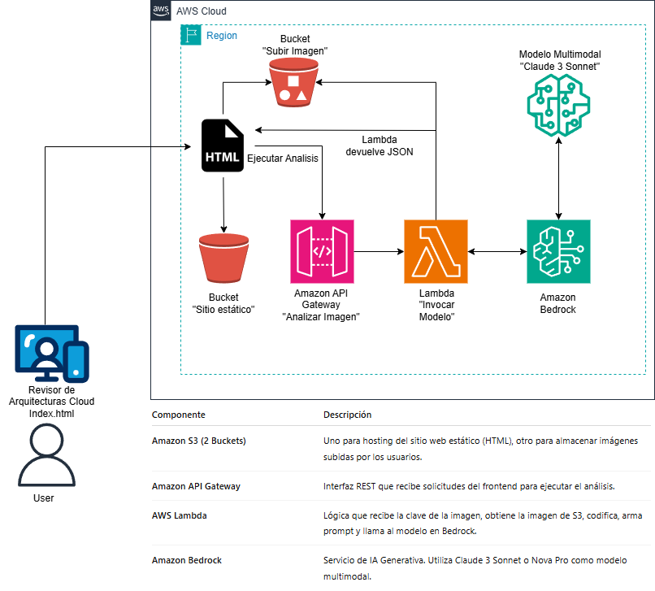
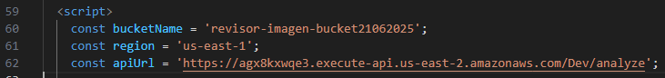

# 🧠 Revisor de Arquitecturas Cloud con IA (Claude 3 Sonnet + AWS)



¡Bienvenido al Workshop práctico más innovador del AWS Community Day\! 🚀    
Aquí vas a construir desde cero una aplicación de IA capaz de **analizar imágenes de diagramas de arquitectura Cloud** y darte recomendaciones automáticas usando modelos avanzados de Amazon Bedrock.    
Ideal para **principiantes en AWS e Inteligencia Artificial Generativa** 💡.

---

## 🎯 Objetivo del Lab

✔️ Subir una imagen de arquitectura exportada desde Draw.io    
🧠 Analizar visualmente el contenido con Claude 3 Sonnet    
📊 Recibir una respuesta con:  
- Componentes detectados    
- Flujo de la arquitectura    
- Recomendaciones alineadas al AWS Well-Architected Framework  

---

## 🧑‍🎓 Perfil de Participante

Este taller es para ti si:  
- Estás dando tus primeros pasos en AWS ☁️  
- Quieres entender cómo aplicar IA en la nube sin necesidad de saber programar    
- Deseas aprender haciendo 🛠️

---

## ⚙️ Servicios de AWS Utilizados

- **Amazon S3**: almacenamiento de imágenes + hosting del frontend  
- **AWS Lambda**: backend sin servidores para procesar las imágenes  
- **Amazon Bedrock**: análisis multimodal con Claude 3 Sonnet  
- **API Gateway**: exposición del endpoint HTTP

📍 *Recuerda trabajar en la región `us-east-1` (Virginia) y tener habilitado Claude 3 Sonnet en Bedrock*


## ⚙️ Diagrama de arquitectura aplicación



---

## 👣 Paso a Paso

### 1. Crear los Buckets en S3

**Usarás dos buckets:**
- `revisor-web-bucket`: donde subirás el archivo index.html y activarás el sitio estático
- `revisor-imagenes-bucket`: donde el HTML subirá la imagen que luego será leída por Lambda

#### 🖼️ Crear Bucket para imágenes  
- Nombre sugerido: `revisor-imagenes-bucket`  
- Desactiva el bloqueo público  
- Configura las siguientes políticas y CORS (ver detalles en el documento original)
- Policy para bucket

```bash
{
  "Version": "2012-10-17",
  "Statement": [
    {
      "Sid": "AllowUploadFromFrontend",
      "Effect": "Allow",
      "Principal": "*",
      "Action": ["s3:PutObject", "s3:GetObject"],
      "Resource": "arn:aws:s3:::Nombre-bucket-imagenes/*"
    }
  ]
}
```
- Configurar CORS (Cross-Origin Resource Sharing) para permitir acceso desde HTML

```bash
[
  {
    "AllowedHeaders": ["*"],
    "AllowedMethods": ["PUT", "GET"],
    "AllowedOrigins": ["*"],
    "ExposeHeaders": []
  }
]
```


#### 🌐 Crear Bucket para el sitio web  
- Nombre sugerido: `revisor-web-bucket`  
- Activa el hosting estático  
- Sube el aechivo `index.html` 

```
Tener presente que ya se debe tener el api creado para que la url invoke ya este en el index o se cambia despues
```

- Configura el nombre `index.html`
- Obtener la URL pública del sitio y abrirlo desde el navegador (Probar el 404 not found ) 
- Desactiva el bloqueo público
- Configura permisos de lectura pública

```bash
{
    "Version": "2012-10-17",
    "Statement": [
        {
            "Sid": "LecturaPublicaBucket",
            "Effect": "Allow",
            "Principal": "*",
            "Action": "s3:GetObject",
            "Resource": "arn:aws:s3:::Nombre-Bucket-sitio_web_estático/*"
        }
    ]
}
```
```
reemplaza con el nombre real de tu bucket
```

---

### 2. Crear la función Lambda

- Nombre: `revisorClaudeLambda`  
- Runtime: `Python 3.13`
- Crear rol nuevo con permisos básicos  
- Aumenta el timeout a 90 segundos  
- Asigna permisos:  
  - `AmazonS3ReadOnlyAccess`  
  - `AmazonBedrockFullAccess`  
- Pega el código de `lambda_function.py` y modifica el nombre del bucket de imágenes en la linea 15
- Dar deploy a la lambda

---

### 3. Crear el API Gateway

- Ir a API Gateway > Create API > REST API 
- Nombre: `revisor-api`
- Crear un recurso: `/analyze`
- Habilitar CORS en este recurso
- Crear un método POST vinculado a la Lambda
- Deploy API en un stage llamado `Dev`
- Copiar el endpoint `Invoke URL` para el frontend

```
Ejemplo”https://p0xx5rp8dk.execute-api.us-east-1.amazonaws.com/Dev”
```
---

### 4. Conectar el Frontend

- Abre el `index.html` con un editor de texto 
- Reemplaza:  
  - URL del API (`apiUrl`) y agrega el recurso `/analyze`
  - Nombre del bucket de imágenes 

   

- Sube al bucket del sitio web

---

## 🔍 Validación del Flujo

1. Abre el sitio desde el navegador  
2. Sube una imagen de arquitectura (exportada con buena resolución)  
3. Visualiza los resultados generados por Claude 🧠

---

## 💬 Prompt utilizado en el análisis

```text
1. Lista los servicios de AWS que aparecen en el diagrama.  
2. Describe el flujo de comunicación entre componentes.  
3. Sugiere mejoras concretas por cada pilar del AWS Well Architected Framework.  
📌 Nota: No inventes servicios que no estén presentes visualmente.
```

## ✅ Checklist rápido  
 - Buckets creados y configurados

 - Lambda desplegada con permisos

 - API Gateway funcionando

 - HTML conectado

 - Imagen cargada y respuesta recibida 💡

## ⏱️ Tiempo estimado  
Etapa	                             Tiempo  
Buckets S3	                       10 min  
Lambda	                           10 min  
API Gateway + pruebas	             10 min  
HTML + validación	                 10 min  
Análisis del output	               10 min

## 🚀 ¿Y ahora qué sigue?  
👉 En la segunda parte del laboratorio extenderemos la app con Amazon Textract para analizar texto (OCR) en los diagramas y generar insights aún más profundos.  
🎯 ¡Estás construyendo un sistema real de IA aplicada a arquitectura cloud!

🧠 **"Hoy le enseñaste a una IA a evaluar arquitecturas... ¡mañana podrías enseñarle a construirlas!"** 💥


## 📚 Recursos del laboratorio

**1. Códigos Lambda** [aquí](./recursos/recursos.zip)

**2. Código HTML del frontend** [aquí](./recursos/diagramaspruebas.zip) 

**3. [Documentación oficial de Amazon Bedrock]**(https://docs.aws.amazon.com/bedrock/) 

**4. Diagramas de pruebas** [aquí](./recursos/diagramaspruebas.zip)

---

## 📢 Conecta con la comunidad

- **YouTube:** [CloudOps Guild](https://www.youtube.com/@CloudOpsGuildCommunity)  
- **Medium:** [@marioserranopineda](https://medium.com/@marioserranopineda)  
- **LinkedIn (autor):** [Mario Serrano](https://www.linkedin.com/in/mario-rodrigo-serrano-pineda/)  
- **Blog:** [CloudOps Guild](https://cloudopsguild.com/blog/)  
- **MeetUp:** [AWS Cartagena Community](https://www.meetup.com/es-ES/aws-colombia-cartagena/)  
- **Facebook:** [AWS Cartagena](https://www.facebook.com/awscolombiacartagena)

---

🎉 **¡Felicidades por construir tu primera APP con IA!**

---

## 📢 Encuesta


Link encuesta https://forms.gle/coddS6mpSvUjFzCn8


## 📝 Licencia

Este proyecto está bajo la licencia MIT. Consulta el archivo [LICENSE](LICENSE) para más detalles.

---