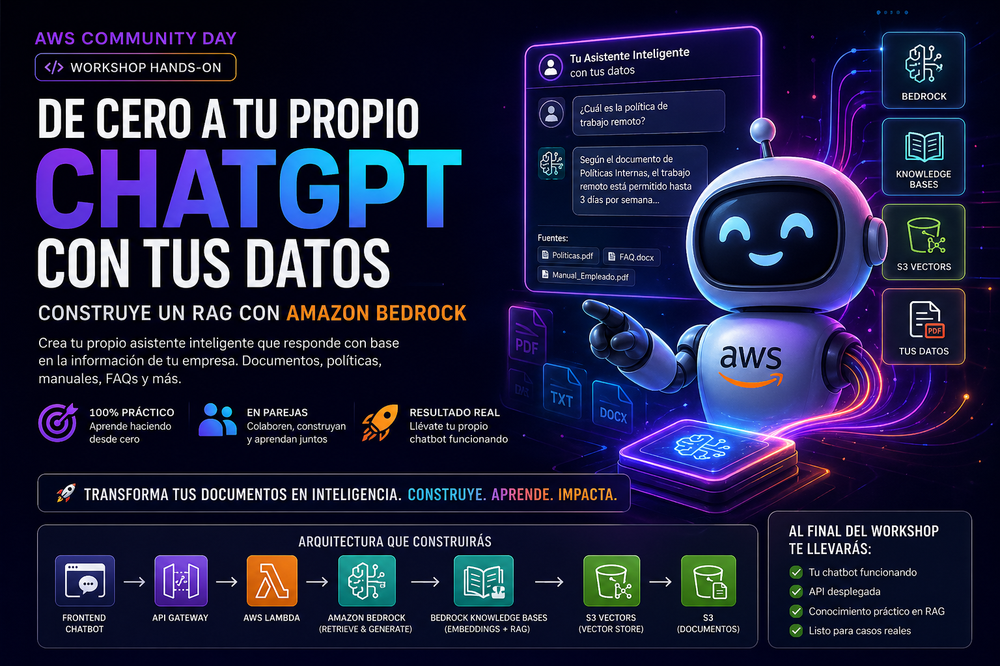
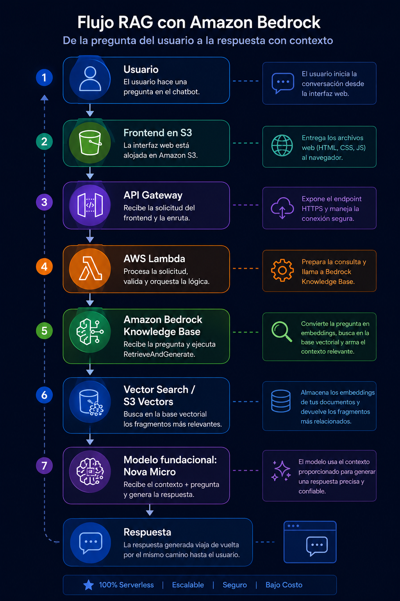
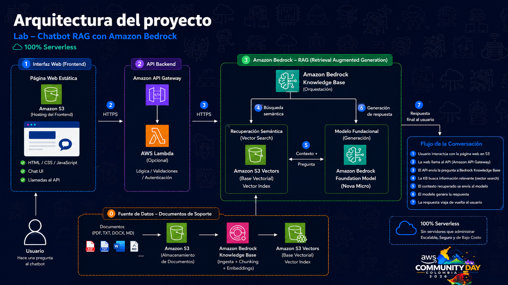
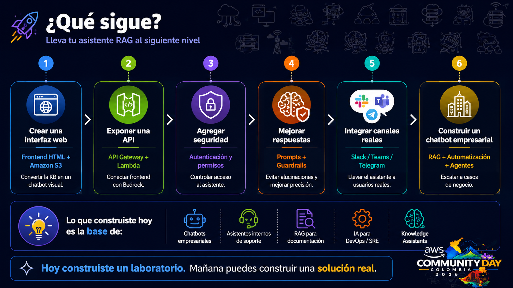

# 🚀 De cero a tu propio ChatGPT con tus datos: construye un RAG con Amazon Bedrock



## 🎯 Objetivo del Workshop

El objetivo de este workshop es aprender, paso a paso y desde cero, cómo construir un asistente inteligente basado en **RAG (Retrieval-Augmented Generation)** usando **Amazon Bedrock Knowledge Bases**.

Al finalizar este laboratorio, tendrás un chatbot capaz de responder preguntas usando información propia almacenada en documentos, en lugar de depender únicamente del conocimiento general del modelo.

Este workshop está diseñado para personas que están empezando en AWS, IA Generativa o arquitecturas cloud. No necesitas ser experto para seguirlo.

---

## 🧠 ¿Qué vas a construir?

Construirás un asistente de soporte técnico que responde usando documentos propios cargados en **Amazon S3** y consultados mediante una **Knowledge Base de Amazon Bedrock**.

La arquitectura general será:

```text
Usuario
  ↓
Pregunta
  ↓
Amazon Bedrock Knowledge Base
  ↓
Búsqueda semántica en documentos
  ↓
Modelo de lenguaje en Amazon Bedrock
  ↓
Respuesta basada en contexto
```




En palabras simples:

> Vamos a crear un asistente tipo ChatGPT, pero conectado a nuestros propios documentos.

---

## 🧩 ¿Qué es RAG?

**RAG** significa **Retrieval-Augmented Generation**, o en español: **Generación Aumentada por Recuperación**.

Un modelo de IA tradicional responde usando lo que aprendió durante su entrenamiento. El problema es que no conoce tus documentos internos, políticas, manuales, procedimientos o información actualizada.

RAG soluciona esto agregando un paso previo:

1. El usuario hace una pregunta.
2. El sistema busca información relevante en tus documentos.
3. Esa información se entrega como contexto al modelo.
4. El modelo responde usando ese contexto.

Así evitamos que la IA invente respuestas y logramos que responda con información propia del negocio.

---

## 🏗️ Arquitectura del laboratorio

La solución utiliza los siguientes servicios de AWS:

| Servicio | ¿Para qué se usa? |
|---|---|
| Amazon S3 | Guardar los documentos que usará el asistente |
| Amazon Bedrock | Acceder a modelos de IA generativa |
| Amazon Bedrock Knowledge Bases | Crear la base de conocimiento con búsqueda semántica |
| Embeddings | Convertir texto en representaciones numéricas para búsqueda semántica |
| Vector Store administrado por Bedrock | Almacenar y buscar fragmentos relevantes de los documentos |
| Amazon Bedrock Playground | Probar preguntas y respuestas del asistente |




---

## ✅ Requisitos previos

Antes de comenzar, asegúrate de tener lo siguiente:

### 1. Una cuenta de AWS

Necesitas acceso a una cuenta AWS. Para este workshop, el instructor puede entregar cuentas preconfiguradas.

Si estás usando tu propia cuenta, debes tener permisos para usar:

- Amazon S3
- Amazon Bedrock
- IAM
- Amazon Bedrock Knowledge Bases

---

### 2. Región recomendada

Usaremos la región:

```text
US East (N. Virginia) - us-east-1
```

Es importante usar siempre la misma región durante todo el laboratorio.

---

### 3. Acceso habilitado a modelos en Amazon Bedrock

Amazon Bedrock requiere habilitar acceso a los modelos antes de usarlos.

En este laboratorio usaremos modelos disponibles en Amazon Bedrock para:

- Generar embeddings
- Responder preguntas del usuario

---

## 📁 Estructura recomendada del repositorio

Puedes organizar el repositorio así:

```text
rag-bedrock-workshop/
│
├── README.md
├── assets/
│   ├── banner.png
│   └── architecture.png
│
├── documents/
│   ├── soporte-tecnico-v1.md
│   └── soporte-tecnico-v2.md
│
├── prompts/
│   └── preguntas-prueba.md
│
└── screenshots/
    └── README.md
```

### ¿Qué contiene cada carpeta?

| Carpeta | Descripción |
|---|---|
| `assets/` | Imágenes del laboratorio, arquitectura y banners |
| `documents/` | Documentos que cargaremos a S3 como fuente de conocimiento |
| `prompts/` | Preguntas de prueba para validar el asistente |
| `screenshots/` | Evidencias o capturas del proceso |

---

# 🧪 Laboratorio paso a paso

---

## Paso 0: Entender el escenario del laboratorio

Vamos a simular que una empresa quiere crear un asistente de soporte técnico interno.

El asistente debe responder preguntas como:

- ¿Qué hago si no tengo internet?
- ¿Qué hago si mi computador está lento?
- ¿Cómo solicito acceso a una aplicación?
- ¿Qué hago si olvidé mi contraseña?

La diferencia es que el asistente no responderá desde conocimiento general, sino desde un documento interno que nosotros cargaremos.

---

## Paso 1: Crear el documento base de conocimiento

Crea un archivo llamado:

```text
soporte-tecnico-v1.md
```

Dentro del archivo agrega este contenido:

```markdown
# Manual Interno de Soporte Técnico - Versión 1

## Problemas de conexión a internet

Si un usuario reporta que no tiene conexión a internet, debe seguir estos pasos:

1. Verificar que el cable de red esté conectado correctamente o que el Wi-Fi esté activo.
2. Reiniciar la conexión de red desde el sistema operativo.
3. Validar si otros usuarios tienen el mismo problema.
4. Si el problema persiste, abrir un ticket en la mesa de ayuda.

## Computador lento

Si el computador está lento, el usuario debe:

1. Cerrar aplicaciones que no esté usando.
2. Reiniciar el equipo.
3. Verificar si hay actualizaciones pendientes.
4. Contactar a soporte si el problema continúa.

## Olvido de contraseña

Si el usuario olvidó su contraseña, debe ingresar al portal interno de autoservicio y seleccionar la opción “Restablecer contraseña”.

Si no puede acceder al portal, debe comunicarse con la mesa de ayuda.

## Solicitud de acceso a aplicaciones

Para solicitar acceso a una aplicación, el usuario debe:

1. Ingresar al portal de solicitudes internas.
2. Seleccionar la aplicación requerida.
3. Justificar la necesidad del acceso.
4. Esperar aprobación del jefe directo.

## Regla especial de soporte

El equipo de soporte debe dar respuestas claras, respetuosas y orientadas a resolver el problema del usuario.
```

Guarda el archivo.

---

## Paso 2: Entrar a la consola de AWS

1. Abre el navegador.
2. Ingresa a la consola de AWS.
3. Inicia sesión con las credenciales entregadas por el instructor o con tu cuenta personal.
4. Verifica que estás en la región correcta:

```text
us-east-1
```

En la parte superior derecha de la consola puedes cambiar la región.

---

## Paso 3: Crear un bucket en Amazon S3

Amazon S3 será el lugar donde guardaremos los documentos que el asistente usará como conocimiento.

### Pasos:

1. En la barra de búsqueda de AWS escribe:

```text
S3
```

2. Entra al servicio **S3**.
3. Haz clic en **Create bucket**.
4. En el nombre del bucket escribe algo único, por ejemplo:

```text
rag-bedrock-workshop-tu-nombre
```

Ejemplo:

```text
rag-bedrock-workshop-mario-2026
```

> Nota: El nombre del bucket debe ser único a nivel global. Si AWS te dice que ya existe, cambia el nombre.

5. En región selecciona:

```text
US East (N. Virginia) us-east-1
```

6. Deja las demás opciones por defecto.
7. Haz clic en **Create bucket**.

---

## Paso 4: Subir el documento a S3

1. Entra al bucket que acabas de crear.
2. Haz clic en **Upload**.
3. Haz clic en **Add files**.
4. Selecciona el archivo:

```text
soporte-tecnico-v1.md
```

5. Haz clic en **Upload**.

Cuando termine la carga, tu documento estará disponible en S3.

---

## Paso 5: Verificar permisos para modelos en Amazon Bedrock

Antes de usar Amazon Bedrock, debes habilitar acceso a los modelos a través de IAM.

---

## Paso 6: Crear una Knowledge Base en Amazon Bedrock

Ahora crearemos la base de conocimiento que conectará Amazon Bedrock con los documentos almacenados en S3.

### Pasos:

1. En Amazon Bedrock, busca en el menú izquierdo la opción:

```text
Knowledge Bases
```

2. Haz clic en **Create knowledge base**.
3. Selecciona la opción para crear una Knowledge Base con vector store administrado por Bedrock, si está disponible.
4. Asigna un nombre:

```text
kb-soporte-tecnico-workshop
```

5. En descripción puedes escribir:

```text
Base de conocimiento para asistente de soporte técnico usando RAG con Amazon Bedrock.
```

6. En permisos, permite que AWS cree el rol automáticamente si aparece esa opción.

---

## Paso 7: Configurar la fuente de datos desde S3

La Knowledge Base necesita saber dónde están los documentos.

### Pasos:

1. En la configuración de Data Source selecciona:

```text
Amazon S3
```

2. Selecciona el bucket que creaste.
3. Indica la ruta donde está el documento.

Si subiste el archivo directamente al bucket, puedes seleccionar el bucket completo.

4. Asigna un nombre a la fuente de datos:

```text
s3-soporte-tecnico-documents
```

---

## Paso 8: Configurar embeddings

Los embeddings permiten convertir el texto en representaciones numéricas para que el sistema pueda encontrar información por significado, no solo por palabras exactas.

### Pasos:

1. En la sección de modelo de embeddings, selecciona un modelo disponible.
2. Recomendación:

```text
Amazon Titan Embeddings
```

3. Continúa con la configuración.

---

## Paso 9: Crear o seleccionar el vector store

El vector store es donde se guardarán los fragmentos convertidos en embeddings.

Dependiendo de la consola y la configuración de tu cuenta, puedes ver opciones como:

- Crear vector store automáticamente
- Usar Amazon OpenSearch Serverless
- Usar una opción administrada por Bedrock

Para un laboratorio beginner, usa la opción más simple disponible:

```text
Quick create / Bedrock managed vector store
```

Si la consola te ofrece crear los recursos automáticamente, acepta esa opción.

---

## Paso 10: Revisar y crear la Knowledge Base

Antes de crearla:

1. Revisa el nombre de la Knowledge Base.
2. Verifica que la fuente de datos sea tu bucket de S3.
3. Verifica que el modelo de embeddings esté seleccionado.
4. Haz clic en **Create knowledge base**.

La creación puede tardar algunos minutos.

---

## Paso 11: Sincronizar la fuente de datos

Crear la Knowledge Base no siempre significa que los documentos ya estén indexados.

Debes sincronizar la fuente de datos.

### Pasos:

1. Entra a la Knowledge Base creada.
2. Busca la sección **Data sources**.
3. Selecciona tu fuente de datos.
4. Haz clic en:

```text
Sync
```

5. Espera a que el estado indique que la sincronización fue exitosa.

Esto significa que Bedrock ya leyó el documento, lo fragmentó, generó embeddings y lo dejó listo para consultas.

---

## Paso 12: Probar la Knowledge Base

Ahora vamos a probar si el asistente responde usando el documento.

En la consola de Bedrock, busca la opción para probar la Knowledge Base.

Haz preguntas como:

```text
¿Qué debe hacer un usuario si no tiene conexión a internet?
```

Respuesta esperada:

```text
Debe verificar el cable de red o Wi-Fi, reiniciar la conexión, validar si otros usuarios tienen el mismo problema y, si persiste, abrir un ticket en la mesa de ayuda.
```

Prueba también:

```text
¿Qué debe hacer un usuario si olvidó su contraseña?
```

Respuesta esperada:

```text
Debe ingresar al portal interno de autoservicio y seleccionar la opción Restablecer contraseña. Si no puede acceder, debe comunicarse con la mesa de ayuda.
```

---

## Paso 13: Validar que el asistente responde con contexto

Ahora haz una pregunta que no esté en el documento:

```text
¿Cuál es la política de vacaciones de la empresa?
```

Respuesta esperada:

```text
No tengo información suficiente en los documentos proporcionados para responder esa pregunta.
```

Esto es importante porque demuestra que el asistente no debe inventar información.

---

## Paso 14: Actualizar el documento para demostrar sincronización

Ahora vamos a demostrar algo muy importante: el asistente puede cambiar sus respuestas cuando actualizamos la información fuente.

Crea un segundo archivo llamado:

```text
soporte-tecnico-v2.md
```

Con este contenido:

```markdown
# Manual Interno de Soporte Técnico - Versión 2

## Problemas de conexión a internet

Si un usuario reporta que no tiene conexión a internet, debe seguir estos pasos:

1. Verificar que el cable de red esté conectado correctamente o que el Wi-Fi esté activo.
2. Reiniciar la conexión de red desde el sistema operativo.
3. Validar si otros usuarios tienen el mismo problema.
4. Si el problema persiste, abrir un ticket en la mesa de ayuda.

## Computador lento

Si el computador está lento, el usuario debe:

1. Guardar su trabajo.
2. Reiniciar el equipo.
3. Cerrar aplicaciones innecesarias.
4. Si el problema continúa, contactar a soporte.

## Olvido de contraseña

Si el usuario olvidó su contraseña, debe ingresar al portal interno de autoservicio y seleccionar la opción “Restablecer contraseña”.

Si no puede acceder al portal, debe comunicarse con la mesa de ayuda.

## Solicitud de acceso a aplicaciones

Para solicitar acceso a una aplicación, el usuario debe:

1. Ingresar al portal de solicitudes internas.
2. Seleccionar la aplicación requerida.
3. Justificar la necesidad del acceso.
4. Esperar aprobación del jefe directo.

## Regla especial de soporte actualizada

Cuando un usuario reporte un problema técnico básico, el asistente debe responder primero con la frase:

"Por favor, apague y prenda el equipo antes de continuar con el diagnóstico."

Después de esa frase, debe entregar los pasos de solución correspondientes según el problema reportado.
```

Este segundo documento incluye una nueva regla especial.

---

## Paso 15: Reemplazar o subir el nuevo documento a S3

Tienes dos opciones:

### Opción A: Reemplazar el documento anterior

1. Elimina `soporte-tecnico-v1.md` del bucket.
2. Sube `soporte-tecnico-v2.md`.

### Opción B: Subir ambos documentos

1. Sube `soporte-tecnico-v2.md` al mismo bucket.
2. Mantén también el documento anterior.

Para evitar confusión en el workshop, se recomienda usar la **Opción A**.

---

## Paso 16: Sincronizar nuevamente la Knowledge Base

Después de subir el nuevo documento, debes sincronizar otra vez.

### Pasos:

1. Vuelve a Amazon Bedrock.
2. Entra a tu Knowledge Base.
3. Ve a **Data sources**.
4. Selecciona la fuente de datos.
5. Haz clic en **Sync**.
6. Espera a que termine correctamente.

---

## Paso 17: Probar el cambio de comportamiento

Ahora pregunta:

```text
Mi computador está lento, ¿qué debo hacer?
```

Respuesta esperada:

```text
Por favor, apague y prenda el equipo antes de continuar con el diagnóstico.

Luego guarde su trabajo, reinicie el equipo, cierre aplicaciones innecesarias y contacte a soporte si el problema continúa.
```

Con esto demostramos que:

- El asistente responde con base en documentos.
- Si el documento cambia, la respuesta también cambia.
- El modelo no necesita ser reentrenado.
- Solo actualizamos la base de conocimiento.

---

## Paso 18: Pruebas adicionales

Puedes usar estas preguntas para validar el comportamiento del asistente:

```text
¿Qué hago si no tengo internet?
```

```text
¿Cómo solicito acceso a una aplicación?
```

```text
¿Qué hago si olvidé mi contraseña?
```

```text
¿Cuál es la política de vacaciones de la empresa?
```

```text
¿Cuál es el procedimiento para reportar un computador lento?
```

---

## Paso 19: Buenas prácticas para RAG

Cuando construyas soluciones RAG reales, ten en cuenta estas recomendaciones:

### 1. Usa documentos claros

Mientras más claro esté el documento, mejor responderá el asistente.

Evita documentos desordenados, contradictorios o incompletos.

---

### 2. Divide bien la información

Los documentos deben tener secciones, títulos y subtítulos claros.

Ejemplo:

```markdown
## Problemas de red
## Contraseñas
## Accesos
## Aplicaciones internas
```

---

### 3. Evita información duplicada o contradictoria

Si dos documentos dicen cosas diferentes, el asistente puede responder de forma inconsistente.

---

### 4. Prueba preguntas reales

No pruebes solo preguntas perfectas.

Prueba preguntas como las haría un usuario real:

```text
No me funciona el internet, ¿qué hago?
```

```text
Se me olvidó la clave, ayuda
```

```text
Mi compu está muy lenta
```

---

### 5. Define qué debe hacer cuando no sabe

Un buen asistente no debe inventar.

Puedes indicarle que responda:

```text
No encontré información suficiente en la base de conocimiento para responder esa pregunta.
```

---

## 🧹 Limpieza de recursos

Al finalizar el laboratorio, elimina los recursos para evitar costos innecesarios.

### Recursos a eliminar:

1. Knowledge Base de Amazon Bedrock
2. Data Source asociada
3. Vector store creado automáticamente, si aplica
4. Bucket de S3
5. Documentos cargados en S3
6. Roles IAM creados automáticamente, si aplica

### Eliminar bucket de S3

1. Entra a S3.
2. Abre el bucket.
3. Elimina los archivos.
4. Luego elimina el bucket.

### Eliminar Knowledge Base

1. Entra a Amazon Bedrock.
2. Ve a Knowledge Bases.
3. Selecciona la Knowledge Base.
4. Elimínala.

> Importante: Si Bedrock creó recursos adicionales como vector stores, revisa que también se eliminen.

---

## 🧠 Conceptos aprendidos

Al completar este laboratorio, habrás aprendido:

- Qué es RAG
- Por qué RAG es útil en aplicaciones empresariales
- Cómo usar Amazon S3 como fuente de datos
- Qué son los embeddings
- Qué es una Knowledge Base en Amazon Bedrock
- Cómo sincronizar documentos
- Cómo probar un asistente basado en datos propios
- Cómo actualizar la información del asistente sin reentrenar el modelo

---

## 🚀 Próximos pasos

Después de completar este laboratorio, puedes extender la solución con:



- Una interfaz web en HTML
- API Gateway + Lambda
- Autenticación de usuarios
- Guardrails para seguridad
- Logs y monitoreo con CloudWatch
- Integración con Slack o Microsoft Teams
- Automatización de carga de documentos
- Evaluación de calidad de respuestas

---

## 💬 Frase clave del workshop

> No se trata solo de usar IA. Se trata de construir soluciones reales con IA usando datos propios, contexto y arquitectura cloud.

---

## Recursos workshop

1. Policy Lambda [aquí](./recursos/Policy_Lambda.txt)
2. Código Lambda [aquí](./recursos/codigo_lambda.txt)
3. Imagen logo [aquí](./recursos/logo.PNG)
4. BD Knowledge v1 [aquí](./recursos/soporte-tecnico-v1.md)
5. BD Knowledge v2 [aquí](./recursos/soporte-tecnico-v2.md)
6. Datos conexión Workshop [aquí](./recursos/datos_conexion_lab.txt)


## 👨‍💻 Autor

**Mario R. Serrano Pineda**  
DevOps SRE | Solutions Architect | AWS Community Builder | AWS New Voices 2026

Comunidad: **CloudOps Guild**

---

## 📌 Nota final

Este laboratorio fue creado con fines educativos para ayudar a la comunidad a entender cómo construir soluciones de IA generativa con datos propios usando AWS.

La idea es que puedas tomar este ejemplo, adaptarlo a tus propios documentos y extenderlo hacia casos reales como:

- Soporte técnico interno
- Asistentes de documentación
- Chatbots empresariales
- Automatización de procesos
- Consultas sobre políticas internas
- Soporte a equipos DevOps, SRE o Cloud

---

## ⭐ Apoya este proyecto

Si este laboratorio te fue útil, puedes apoyar el repositorio con una estrella ⭐ y compartirlo con otras personas interesadas en aprender AWS, DevOps e Inteligencia Artificial.

