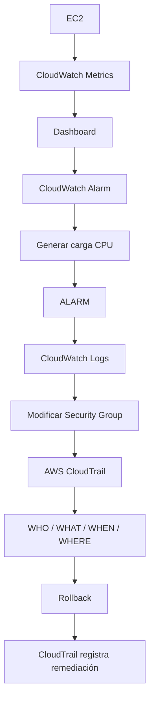

# 🔥 CloudOps Challenge — Módulo 9
## Incidente en Producción: ¿Qué está pasando y quién hizo el cambio?

Laboratorio hands-on de **Amazon CloudWatch + AWS CloudTrail** orientado a operaciones CloudOps/SRE.

Durante el laboratorio cada participante:

1. Observa métricas de una instancia EC2.
2. Construye un dashboard en CloudWatch.
3. Crea una alarma de CPU.
4. Provoca un incidente controlado.
5. Investiga logs de aplicación.
6. Modifica un Security Group.
7. Encuentra su propia actividad en CloudTrail.
8. Revierte el cambio y valida la evidencia del rollback.

## 🎯 Objetivos de aprendizaje

Al finalizar podrás responder:

- ¿Qué está ocurriendo con mi infraestructura?
- ¿Cómo detecto automáticamente una condición anormal?
- ¿Qué estaba reportando la aplicación durante el incidente?
- ¿Quién modificó un recurso AWS?
- ¿Qué API se ejecutó?
- ¿Cuándo y desde dónde ocurrió?
- ¿Cómo queda auditada la remediación?

## 🧠 Flujo del GameDay

## 🏗️ Infraestructura preparada

El instructor entrega una cuenta AWS con:

- EC2 Amazon Linux 2023
- IAM Role para SSM + CloudWatch Agent
- Systems Manager Session Manager
- Security Group controlado
- CloudWatch Agent
- Log Group `/cloudops/m9/application`
- Métrica custom `CloudOps/M9 → mem_used_percent`
- Script `/opt/cloudops/generate-load.sh`
- Script `/opt/cloudops/generate-logs.sh`

El participante **no necesita construir la infraestructura base**.

## 👨‍💻 Lo que construye el participante

- Dashboard `cloudops-m9-dashboard`
- Alarm `cloudops-m9-high-cpu`
- Incidente de CPU
- Investigación de logs
- Cambio temporal de Security Group
- Investigación con CloudTrail
- Rollback del cambio

## 🚀 Empieza aquí

👉 [Guía del participante](docs/02-participant-guide.md)

Para instructores:

👉 [Guía del instructor](docs/01-instructor-guide.md)

Para desplegar el laboratorio:

👉 [Preparación del entorno](docs/03-environment-setup.md)

Problemas comunes:

👉 [Troubleshooting](docs/05-troubleshooting.md)

## ⏱️ Duración

Diseñado para un hands-on de aproximadamente **45 minutos**.

## 📦 Infrastructure as Code

El template validado está en:

`infrastructure/cloudformation/cloudops-m9.yaml`

Fue probado end-to-end con:

- CloudFormation `CREATE_COMPLETE`
- Session Manager
- CloudWatch Agent
- CloudWatch Logs
- `mem_used_percent`
- `CPUUtilization`
- CPU stress
- logs WARN/ERROR
- recuperación del script

## 🛡️ Seguridad del laboratorio

Se recomienda aplicar una SCP de guardrail a la OU de cuentas de laboratorio después de crear la infraestructura.

Consulta:

[Guardrail SCP](docs/06-scp-guardrail.md)

## 🧹 Cleanup

Consulta:

[Cleanup](cleanup/README.md)
