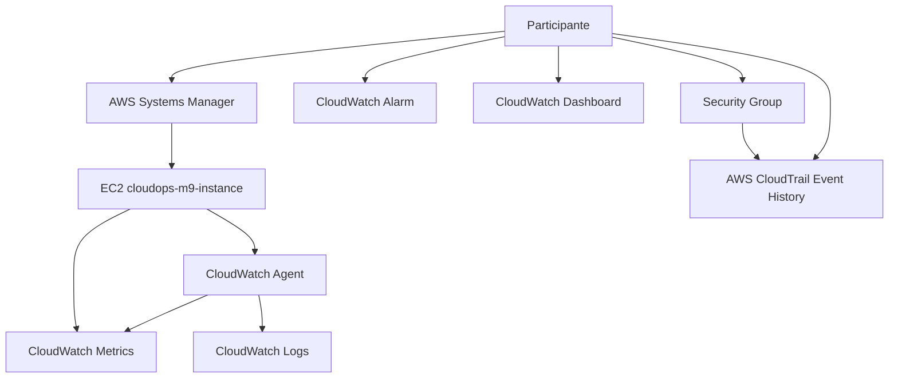

# Arquitectura

```mermaid
flowchart TD
    P[Participante]
    EC2[EC2 cloudops-m9-instance]
    SSM[AWS Systems Manager]
    CWA[CloudWatch Agent]
    CWM[CloudWatch Metrics]
    CWL[CloudWatch Logs]
    AL[CloudWatch Alarm]
    DB[CloudWatch Dashboard]
    SG[Security Group]
    CT[AWS CloudTrail Event History]

    P --> DB
    P --> AL
    P --> SSM
    SSM --> EC2
    EC2 --> CWM
    EC2 --> CWA
    CWA --> CWL
    CWA --> CWM
    P --> SG
    SG --> CT
    P --> CT
```

## Namespaces

- EC2 estándar: `AWS/EC2`
- Métrica custom: `CloudOps/M9`

## Log Group

`/cloudops/m9/application`
