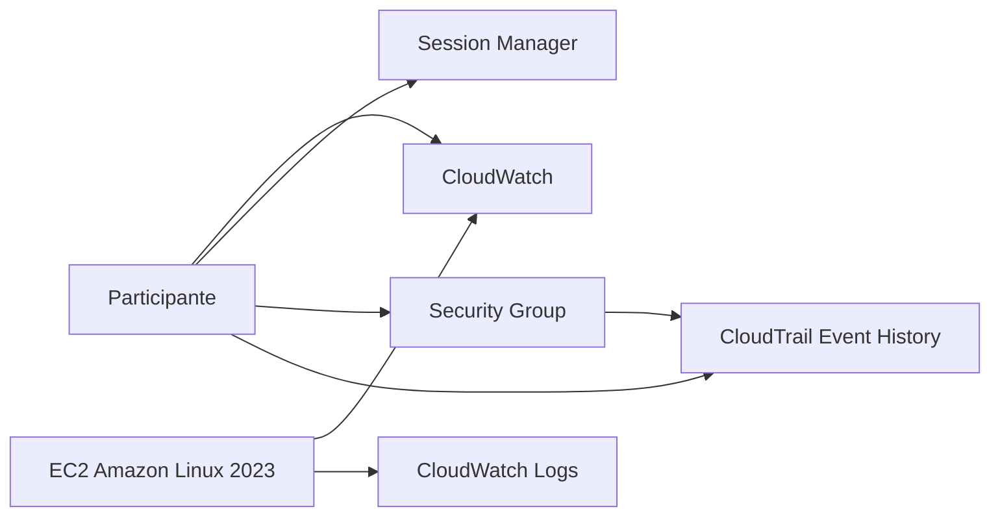

# Preparación del entorno

## Región

`us-east-1` — US East (N. Virginia)

## Arquitectura base



## Recursos base

### IAM Role

Nombre:

`cloudops-m9-ec2-role`

Managed policies:

- `AmazonSSMManagedInstanceCore`
- `CloudWatchAgentServerPolicy`

### Security Group

Nombre:

`cloudops-m9-sg`

Inbound:

- ninguna regla

Outbound:

- All traffic → `0.0.0.0/0`

### EC2

- Amazon Linux 2023
- x86_64
- `t3.micro`
- 8 GiB gp3
- Public IPv4
- sin key pair
- IAM Role: `cloudops-m9-ec2-role`
- Detailed Monitoring: Enabled

## Infrastructure as Code

Usa:

`infrastructure/cloudformation/cloudops-m9.yaml`

El template crea:

- IAM Role
- Instance Profile
- Security Group
- CloudWatch Log Group
- EC2
- CloudWatch Agent
- scripts
- systemd service

No crea:

- Dashboard
- Alarm
- regla HTTP/80

## Validación técnica

### Session Manager

```bash
hostname
whoami
ls -la /opt/cloudops/
```

Debe existir:

- `generate-load.sh`
- `generate-logs.sh`

### Log generator

```bash
sudo systemctl status cloudops-log-generator
```

Debe estar:

`active (running)`

### CloudWatch Agent

```bash
sudo /opt/aws/amazon-cloudwatch-agent/bin/amazon-cloudwatch-agent-ctl -a status
```

Debe mostrar:

- `"status": "running"`
- `"configstatus": "configured"`

### Logs locales

```bash
sudo tail -10 /var/log/cloudops/application.log
```

Debe haber eventos INFO cada 10 segundos.

### CloudWatch Logs

Debe existir:

`/cloudops/m9/application`

### Métrica custom

Debe existir:

`CloudOps/M9 → mem_used_percent`

### Métrica EC2

Debe existir:

`AWS/EC2 → CPUUtilization`

## Acceptance test

```bash
sudo /opt/cloudops/generate-load.sh
```

Validar:

- CPU alta
- WARN/ERROR en CloudWatch Logs
- finalización del script

Si todo pasa, el entorno está listo.
