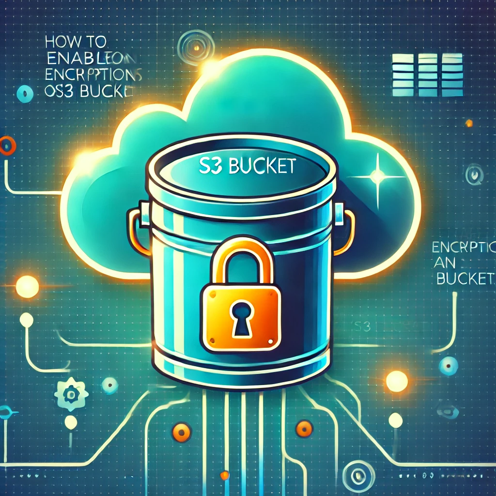

# Activar el Cifrado en un Bucket de S3

Este repositorio contiene instrucciones paso a paso para habilitar el cifrado en un bucket de Amazon S3 utilizando varios métodos de cifrado del lado del servidor (Server-Side Encryption, SSE).

## Descripción General

El cifrado en Amazon S3 es esencial para garantizar la seguridad de los datos almacenados en la nube. A partir de enero de 2023, AWS habilita el cifrado por defecto para todos los buckets nuevos, pero este repositorio también explica cómo activar el cifrado en buckets creados antes de esta fecha.

### Métodos de Cifrado SSE

1. **SSE-S3**: AWS gestiona las claves de cifrado utilizando el algoritmo AES-256.
2. **SSE-KMS**: Permite al usuario gestionar claves maestras (CMK) mediante AWS Key Management Service (KMS).
3. **SSE-C**: El usuario proporciona y administra sus propias claves de cifrado.
4. **DSSE-KMS**: Cifrado de doble capa del servidor utilizando KMS.

## Lista de Pasos

### Activar Cifrado en Buckets Existentes

1. Accede a la consola de AWS y dirígete al servicio de S3.
2. Selecciona el bucket deseado y ve a la pestaña "Propiedades".
3. En la sección "Default Encryption", selecciona "Editar".
4. Elige el método de cifrado que deseas usar:
   - **SSE-S3**
   - **SSE-KMS** (selecciona una clave gestionada por AWS o una clave personalizada).
   - **DSSE-KMS**.
5. Guarda los cambios.

### Crear un Nuevo Bucket con Cifrado Activado

1. Accede a la consola de AWS y selecciona "Crear bucket".
2. Llena la información requerida y navega hasta la sección de cifrado.
3. Selecciona el método de cifrado deseado (SSE-S3, SSE-KMS, DSSE-KMS).
4. Completa la creación del bucket.

## Recomendaciones

- Utiliza **SSE-KMS** para datos sensibles, ya que ofrece mayor control y auditoría.
- Habilita el versionado de buckets para prevenir pérdidas accidentales.
- Activa los registros de acceso a S3 para monitorear actividades sospechosas.
- Usa herramientas como **AWS Config** para verificar el cumplimiento del cifrado.

## Observaciones Importantes

1. El uso de claves personalizadas (CMK) puede generar costos adicionales.
2. Algunos servicios o regiones pueden tener restricciones sobre métodos de cifrado.

## Recursos Adicionales

- [Documentación oficial sobre cifrado en S3](https://docs.aws.amazon.com/AmazonS3/latest/userguide/serv-side-encryption.html)
- [AWS Key Management Service (KMS)](https://docs.aws.amazon.com/kms/latest/developerguide/overview.html)
- [Video explicativo en YouTube](https://youtu.be/bt_jaJyYLro?si=Jz-TojOEL6g3aSvN)
- [Guía paso a paso](recursos/activar_cifrado_bucket.pdf)

## 🤝 **Conecta conmigo**
- **YouTube:** [CloudOps Guild](https://www.youtube.com/@CloudOpsGuildCommunity)
- **Medium:** [@marioserranopineda](https://medium.com/@marioserranopineda)
- **LinkedIn:** [Mario Serrano](https://www.linkedin.com/in/mario-rodrigo-serrano-pineda/)

