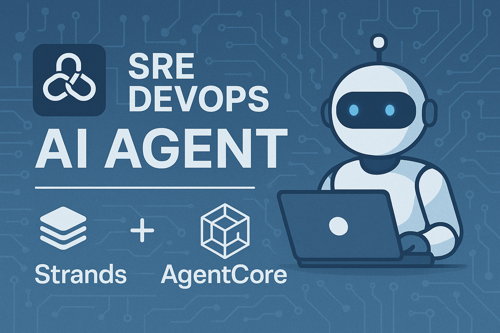
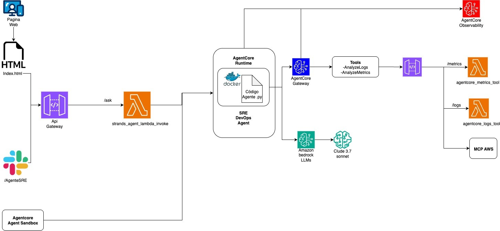

# 🧪 Lab Completo: Hospeda tu Agente Strands en Amazon Bedrock AgentCore (end-to-end)



En este laboratorio construirás un agente Strands SRE DevOps, lo empaquetarás en un contenedor Docker, lo subirás a Amazon ECR y lo ejecutarás como un runtime en Amazon Bedrock AgentCore. Finalmente, montarás un backend (Lambda + API Gateway) y un frontend HTML para probar el flujo end-to-end.

---

## 🎯 Objetivos de Aprendizaje
- Preparar tu entorno de desarrollo local (Python, venv, dependencias, credenciales).
- Construir y subir una imagen Docker con tu agente Strands a Amazon ECR.
- Crear un runtime de AgentCore desde la consola AWS.
- Invocar y probar tu agente desde la pestaña **Test** de AgentCore.
- Crear un backend con **AWS Lambda + API Gateway** para exponer tu agente.
- Conectar un frontend HTML y ejecutar el flujo completo.

---

## ✅ Prerrequisitos
- Cuenta AWS con acceso a **AgentCore (Preview)** y **Bedrock** en la región `us-east-1`.
- Permisos para **ECR**, **Lambda**, **API Gateway**, **CloudWatch Logs**, **IAM**.
- Docker Desktop instalado.
- Python 3.10+ instalado.
- Dockerfile
- Código del agente Strands

### 🗂️ Dibujo del diagrama de arquitectura del proyecto
- 📍 Creación paso a paso del diagrama y explicación en video abajo en Recursos.



---

## 1️⃣ Alistar el entorno de desarrollo local

1. Verificar instalación de Python:
   ```bash
   python3 --version
   ```
2. Crear entorno virtual:
   ```bash
   python3 -m venv .venvagent
   ```
3. Activar el entorno virtual:
   ```bash
   source .venvagent/bin/activate
   ```
4. Instalar dependencias:
   ```bash
   pip install -r requirements.txt
   ```
5. Trabajar dentro del entorno virtual.
6. Validar credenciales AWS (elige uno):
   ```bash
   aws sso login --profile <perfil>
   ```
   o
   ```bash
   aws configure
   ```
7. Salir del entorno virtual:
   ```bash
   deactivate
   ```

---

## 2️⃣ Construcción local y push a ECR

### 2.1 Crear repositorio en ECR (Consola)
1. Ve a **ECR → Repositories → Create repository**.
2. Nombre: `agent` (o el que prefieras).
3. Tipo: **Private**. Deja el resto por defecto.
4. Copia la URI del repo (ej: `123456789012.dkr.ecr.us-east-1.amazonaws.com/agent`).

### 2.2 Construir y subir imagen Docker
Define variables en tu terminal:
```bash
ACCOUNT_ID=123456789012
REGION=us-east-1
REPO=agent
IMAGE_TAG=v1
REG_URI=$ACCOUNT_ID.dkr.ecr.$REGION.amazonaws.com
```

Build limpio con etiqueta de build:
```bash
APP_BUILD=$(date -u +%Y%m%dT%H%M%SZ)
docker build --no-cache -t $REPO:$IMAGE_TAG --label app.build=$APP_BUILD .
```

Login a ECR con DOCKER_CONFIG limpio (workaround para credenciales):
```bash
mkdir -p ~/.docker-plain
printf '{}\n' > ~/.docker-plain/config.json
DOCKER_CONFIG=$HOME/.docker-plain aws ecr get-login-password --region $REGION \
| DOCKER_CONFIG=$HOME/.docker-plain docker login --username AWS --password-stdin $REG_URI
```

Si falla por credenciales, intenta:
```bash
export AWS_PROFILE=mario_adl_common_dev
export DOCKER_CONFIG=$HOME/.docker-plain
mkdir -p $DOCKER_CONFIG
aws ecr get-login-password --region $REGION \
  | docker login --username AWS --password-stdin $REG_URI
```

Tag + push:
```bash
docker tag $REPO:$IMAGE_TAG $REG_URI/$REPO:$IMAGE_TAG
DOCKER_CONFIG=$HOME/.docker-plain docker push $REG_URI/$REPO:$IMAGE_TAG
```

Verifica la etiqueta de build en la imagen remota:
```bash
docker rmi $REG_URI/$REPO:$IMAGE_TAG >/dev/null 2>&1 || true
docker pull $REG_URI/$REPO:$IMAGE_TAG
docker image inspect $REG_URI/$REPO:$IMAGE_TAG --format '{{index .Config.Labels "app.build"}}'
```

---

## 3️⃣ Crear runtime en AgentCore (Consola)
1. Ve a **Amazon Bedrock → AgentCore runtimes → Create runtime**.
2. Nombre: `strands-agent-runtime`.
3. Imagen: pega la URI de ECR (`.../$REPO:$IMAGE_TAG`).
4. Puerto: `8080`.
5. Rol de ejecución (IAM): debe tener permisos a Bedrock, ECR y CloudWatch Logs.
6. Crear runtime y esperar a que el estado sea **READY**.

### Probar en pestaña Test
Ejemplo de payload:
```json
{"prompt":"What is 2+2?"}
```

---

## 4️⃣ Backend con Lambda + API Gateway

### 4.1 Crear Lambda
1. Ve a **Lambda → Create function**.
2. Runtime: Python 3.11.
3. Rol: `AWSLambdaBasicExecutionRole` + permisos para invocar AgentCore Runtime.
4. Variables de entorno:
   - `AGENT_RUNTIME_ARN` = ARN de tu runtime
   - `AGENT_REGION` = us-east-1

Código básico de Lambda (ejemplo):
```python
import os, boto3, json

def lambda_handler(event, context):
    client = boto3.client("bedrock-agentcore", region_name=os.environ["AGENT_REGION"])
    response = client.invoke_agent_runtime(
        agentRuntimeArn=os.environ["AGENT_RUNTIME_ARN"],
        qualifier="DEFAULT",
        payload=json.dumps(event)
    )
    return {
        "statusCode": 200,
        "body": response["response"]
    }
```

### 4.2 API Gateway
1. Crea **HTTP API**.
2. Integra con tu Lambda.
3. Ruta: `POST /ask`.
4. Habilita CORS (* para el lab).
5. Deploy y copia la **Invoke URL**.

---

## 5️⃣ Frontend HTML
Ejemplo simple (`index.html`):
```html
<!DOCTYPE html>
<html>
  <body>
    <h2>Pregúntale a tu Agente</h2>
    <input id="q" placeholder="Escribe tu pregunta"/>
    <button onclick="ask()">Enviar</button>
    <pre id="resp"></pre>
    <script>
      async function ask() {
        const q = document.getElementById("q").value;
        const r = await fetch("YOUR_API_GATEWAY_URL/ask", {
          method: "POST",
          headers: {"Content-Type":"application/json"},
          body: JSON.stringify({"prompt": q})
        });
        const data = await r.json();
        document.getElementById("resp").innerText = JSON.stringify(data, null, 2);
      }
    </script>
  </body>
</html>
```

---

## 6️⃣ Prueba end-to-end
1. Invoca en **AgentCore → Test**: `{"prompt":"Hello!"}`.
2. Invoca vía API Gateway con Postman/Thunder Client.
3. Abre tu frontend HTML y consulta a tu agente.

---

## 🔎 Troubleshooting
- **ImagePullBackOff**: revisa permisos de rol e imagen en ECR.
- **ACCESS_DENIED**: habilita Bedrock y el modelo en tu cuenta/región.
- **El runtime no llega a READY**: revisa logs en CloudWatch.
- **Respuestas vacías**: revisa que tu `@app.entrypoint` devuelva texto plano.

---

## 📝 Tips de Producción
- Versiona tus imágenes (`:v1`, `:v2`).
- Usa CI/CD para builds reproducibles.
- Minimiza permisos IAM.
- Asegura CORS de forma granular.

## Recursos del proyecto

**1. [código strands agente](./strands_agent_DevOps_SRE.py)**

**2. [dockerfile](./Dockerfile)**

**3. [Código HTML-Frontend](./frontend_agentcore.html)**

**4. [Código Lambda-Backend](./strands_agent_lambda_invoke.txt)**

**5. [Video proyecto](https://youtu.be/R4wHLd84PdA)**

**6. [docker ignore](./dockerignore)**

**7. [requeriments](./requirements.txt)**


---

¡Listo! Con esto tienes tu agente Strands corriendo en AgentCore, expuesto por API Gateway y consumido desde un frontend HTML. 🚀

✅ Síguenos en nuestras redes sociales:

- **YouTube:** [CloudOps Guild](https://www.youtube.com/@CloudOpsGuildCommunity)
- **Medium:** [@marioserranopineda](https://medium.com/@marioserranopineda)
- **LinkedIn:** [Mario Serrano](https://www.linkedin.com/in/mario-rodrigo-serrano-pineda/)
- **Blog CloudopsGuild:** [Blog](https://cloudopsguild.com/blog/)
- **LinkedIn CloudOpsGuild:** [CloudOps Guild](https://www.linkedin.com/company/cloudopsguild/)
- **MeetUp:** [Grupo MeetUp AWS Cartagena Community](https://www.meetup.com/es-ES/aws-colombia-cartagena/)
- **Facebook:** [AWS Cartagena Community](https://www.meetup.com/es-ES/aws-colombia-cartagena/)


## 📝 **Licencia**
Este proyecto está bajo la licencia MIT. Puedes consultar los detalles en el archivo [LICENSE](LICENSE).

---


