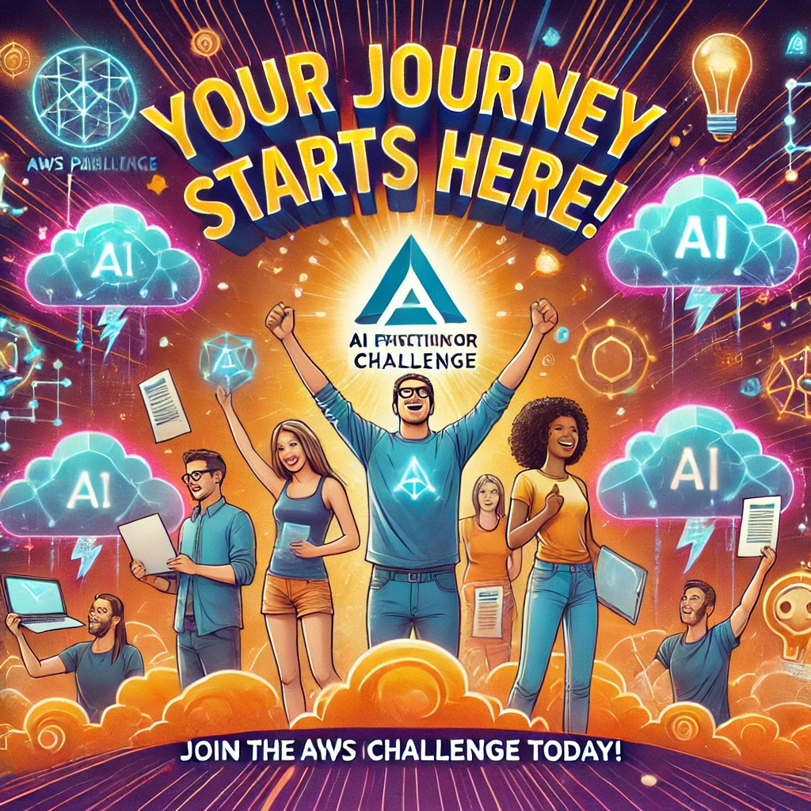

# AWS AI Practitioner Challenge

## ✨ Prepárate para el Challenge AWS AI Practitioner ✨

¡Bienvenido al desafío que transformará tu futuro profesional en la nube! En este reto de 5 semanas, dominarás los conceptos clave para obtener la certificación AWS AI Practitioner, con la oportunidad de acceder a 2 semanas adicionales de contenido exclusivo para suscriptores. 🌟

## 🔎 ¿Qué aprenderás?

## Semana 1: 🚀 Lanzamiento oficial

Introducción al Challenge.

Objetivos y plan de estudios.

Tips para el éxito durante el programa.

**Free Foundational exam retake [Voucher](https://www.pearsonvue.com/us/en/aws/emfreeretake25.html)
(if you need it)**

[Plan de entrenamiento digital](https://explore.skillbuilder.aws/learn/public/learning_plan/view/2193/standard-exam-prep-plan-aws-certified-ai-practitioner-aif-c01)

[Grabación](https://youtube.com/live/VkEY7_1L330)

[Slides](recursos/Semana1_Challenge_AWS_AI_Practitioner.pdf)

## Semana 2: 🧠 Fundamentos de ML y IA

Principios de Machine Learning y Artificial Intelligence.

Casos de uso en industrias clave.

Introducción a las herramientas de AWS para IA.

[Grabación](https://youtu.be/5LBPsqmE7YI)

[Slides](recursos/Semana2_Challenge_AWS_AI_Practitioner.pdf)

## Semana 3: 🤖 Desarrollo de soluciones ML e IA Generativa

Creación de modelos de Machine Learning.

Conceptos de IA Generativa.

Ingeniería de Prompts.

[Grabación](https://youtube.com/live/q_ueIGCyGb0)

[Slides](recursos/Semana3_ChallengeAWS_AI_Practitioner.pdf)

## Semana 4: 🔧 Optimización, seguridad y gobierno

Mejores prácticas para optimizar soluciones IA.

Seguridad y cumplimiento en proyectos de IA.

Gobernanza en soluciones basadas en la nube.

[Grabación](https://youtube.com/live/_xnJ-BEabgA)

[Slides](recursos/Semana4_Challenge_AWS_AI_Practitioner.pdf)

## Semana 5: 🌟 Amazon Q y Amazon Bedrock

Exploración de Amazon Q.

Introducción a Amazon Bedrock y sus aplicaciones.

[Grabación](https://youtube.com/live/C09kXmoFThM)

[Slides](recursos/Semana_5_Challenge_AWS_AI_Practitioner.pdf)

## 🌟 Semanas exclusivas para suscriptores

## Semana 6: 📘 Simuladores de preguntas

Práctica intensiva con simuladores.

Resolución de dudas en vivo.

## Semana 7: 🛠️ Laboratorios hands-on

Ejercicios prácticos avanzados.

Aplicación de conceptos en escenarios reales.

Nota: Estas semanas son exclusivas para suscriptores que formen parte de nuestras redes sociales y cumplan con los requisitos de participación. 🔑

Sigue el programa para acceder a los recursos aquí [Programa Challenge](recursos/Programa_Challenge_AI_practitioner.pdf)

## 🔥 ¿Por qué unirte?

Aprende de expertos en AWS y Cloud Computing.

Acceso a contenido exclusivo y práctico.

Conexión con una comunidad global apasionada por la tecnología.

Mejora tu perfil profesional con una certificación reconocida mundialmente.

## 🌟 Beneficios exclusivos para suscriptores

Si eres parte de nuestra comunidad en Meetup, estás suscrito al canal de YouTube CloudOps Guild y acumulas puntos durante el Challenge, disfrutarás de:

✅ 2 semanas extras de simuladores y laboratorios avanzados.

✅ Acceso a sesiones interactivas en Kahoot.

## 🔗  ¡Inscríbete ahora!

✅ Regístrate aquí: [Formulario](https://bit.ly/registroAIchallenge)

✅ Síguenos en nuestras redes sociales:

- **YouTube:** [CloudOps Guild](https://www.youtube.com/@CloudOpsGuildCommunity)
- **Medium:** [@marioserranopineda](https://medium.com/@marioserranopineda)
- **LinkedIn:** [Mario Serrano](https://www.linkedin.com/in/mario-rodrigo-serrano-pineda/)
- **Blog CloudopsGuild:** [Blog](https://cloudopsguild.com/blog/)
- **LinkedIn CloudOpsGuild:** [CloudOps Guild](https://www.linkedin.com/company/cloudopsguild/)
- **MeetUp:** [Grupo MeetUp AWS Cartagena Community](https://www.meetup.com/es-ES/aws-colombia-cartagena/)
- **Facebook:** [AWS Cartagena Community](https://www.meetup.com/es-ES/aws-colombia-cartagena/)

## Recursos del challenge

**1. [Paths de certificación](recursos/AWS_certification_paths.pdf)**

**2. [Guía del examen AI practitioner](recursos/AWS-Certified-AI-Practitioner_Exam-Guide.pdf)**

**3. [Plan de estudios](recursos/Plan_de_estudios_AI_practitioner_semanas.pdf)**

**4. [Guía pdf: 50 términos, conceptos y servicios más relevantes para el AI Practitioner](recursos/Listado_de_terminos_esenciales.pdf)**

**5. [Checklist de estudio](recursos/Checklist_estudio_AI_Practitioner.xlsx)**

6. guía de estudio

7. Listado de preguntas frecuentes sobre la certificación AWS AI Practitioner

8. Preguntas y respuestas tipo examen

9. Guía de laboratorio: "Crear un chatbot básico con Lex"

10. Guía de laboratorio: "Texto a Voz personalizado"

11. Guía para el Laboratorio: Flujo Integrador con Rekognition, Comprehend y Translate

**12. Videos de Laboratorios Demo Servicios AWS**

**12.1 - [Amazon Comprehend](https://youtu.be/8Yp7tZYL9dc)**

    12.2 - [Amazon Lex]

**12.3 - [Amazon Polly](https://youtu.be/j2zwFkNLQfI)**

**12.4 - [Amazon Textract](https://youtu.be/V5_kK4ZQVGA)**

    12.5 - [Amazon Bedrock]

    12.6 - [Amazon Sage Maker]

# 📅 ¡El desafío comienza pronto!

## ✨ ¡Prepárate para llevar tus habilidades al siguiente nivel y destacar en el mundo del Cloud Computing! ✨

**Fecha de lanzamiento: 21 de Enero, 7:00 PM (COL).**

---

## 📝 **Licencia**
Este proyecto está bajo la licencia MIT. Puedes consultar los detalles en el archivo [LICENSE](LICENSE).

---

