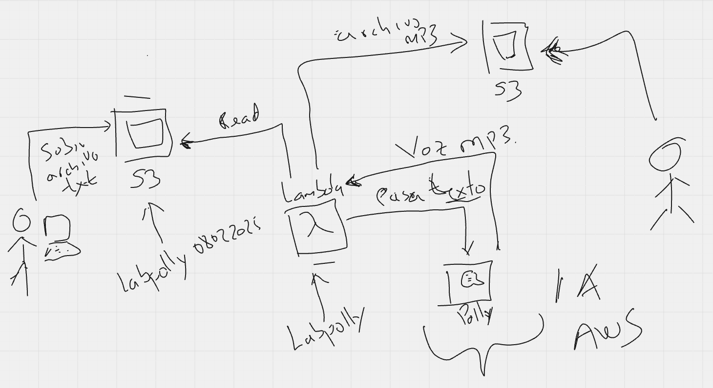

# 🚀 AWS Lambda para Conversión de Texto a Audio con Amazon Polly

Este laboratorio contiene el paso a paso para hacer una aplicación donde cargamos un archivo .TXT a un bucket S3 y a través de Amazon Polly convertimos ese texto en audio, como resultado en nuestro bucket queda un archivo .MP3. 

### 🛠️ Servicios usados durante el laboratorio

- 🔹 **S3**
- 🔹 **Funciones Lambdas**
- 🔹 **Amazon Polly**
- 🔹 **CloudWatch**

### 🗂️ Dibujo del diagrama de arquitectura del laboratorio

---

## 📌 Pasos para Configurar

### 🗂️ 1. Crear un Bucket en S3
- 📍 Crea un bucket en Amazon S3 para almacenar los archivos de texto de entrada y los archivos de audio generados.

### 🛠️ 2. Crear una Nueva Función Lambda
- 📍 Crea una nueva función Lambda en la consola de AWS.
- 📍 Asegúrate de aumentar el tiempo de espera de ejecución por lo menos a 5 segundos (por defecto vienen 3 segundos) para evitar interrupciones en la conversión y errores timeout.

### 🔑 3. Configurar el Rol de IAM
Se escoge la opción de crear un rol por defecto y se le adicionan los permisos para S3 y Amazon Polly
Asegúrate de que la función Lambda tenga un rol de IAM con los siguientes permisos:
- ✅ **S3**: `s3:GetObject`, `s3:PutObject`, `s3:ListBucket`.
- ✅ **Polly**: `polly:SynthesizeSpeech`.
- ✅ **Cloudwatch**: permisos por defecto y básicos de las lambdas para poder ver y crear logs group y logs Streams.

### 📡 4. Configurar un Evento de S3 (OPCIONAL)
- 📍 Configura el bucket de S3 para disparar un evento **ObjectCreated**.
- 📍 Este evento debe activar la función Lambda cuando se suba un archivo de texto.

### 📤 5. Desplegar el Código en Lambda
- 📍 Accede a la consola de AWS Lambda.
- 📍 Copia y pega el código correspondiente en el editor de Lambda.
- 📍 Configura el disparador de S3.

### 🔄 6. Probar el Flujo
1. 📂 Sube un archivo de texto (.txt) al bucket de S3 configurado.
2. 🎧 Verifica que el archivo de audio generado (.mp3) se almacene en el bucket dentro de la carpeta `audio/`.

---

## ⚠️ Consideraciones Importantes
- 🔹 **Formato del Nombre de Archivo**: Evita caracteres especiales y espacios en los nombres de archivo.
- 🔹 **Permisos**: Asegúrate de que Lambda tiene acceso de lectura y escritura en S3 y los permisos en Amazon Polly.
- 🔹 **Tiempo de Ejecución**: Aumenta el tiempo de espera de Lambda si el archivo de texto es grande.

---

## 📌 Notas Adicionales

### 🎙️ Cambiar la Voz
- 🔹 Puedes modificar el parámetro `VoiceId` para elegir entre voces como *Matthew, Amy, Justin*, etc.
- 🔹 Consulta la documentación de [Amazon Polly Voices](https://docs.aws.amazon.com/polly/latest/dg/voicelist.html) para más opciones.

### ⚡ Optimización
- 🔹 Si el archivo de texto es muy grande, divídelo en fragmentos manejables antes de enviarlo a Polly.

### 🛑 Manejo de Errores
- 🔹 Se manejan errores básicos, como archivos de texto vacíos.
- 🔹 Puedes agregar más validaciones según tus necesidades.

---

## Recursos del challenge

**1. [archivo TXT con texto a convertir](recursos/descripcioncomunidad.txt)**
**2. [codigo en Python función Lambda](recursos/funcion_python.txt)**
**3. [archivo .MP3 con audio](recursos/descripcioncomunidad2.mp3)**
**4. [Video del laboratorio](URL)**

---

✅ Síguenos en nuestras redes sociales:

- **YouTube:** [CloudOps Guild](https://www.youtube.com/@CloudOpsGuildCommunity)
- **Medium:** [@marioserranopineda](https://medium.com/@marioserranopineda)
- **LinkedIn:** [Mario Serrano](https://www.linkedin.com/in/mario-rodrigo-serrano-pineda/)
- **Blog CloudopsGuild:** [Blog](https://cloudopsguild.com/blog/)
- **LinkedIn CloudOpsGuild:** [CloudOps Guild](https://www.linkedin.com/company/cloudopsguild/)
- **MeetUp:** [Grupo MeetUp AWS Cartagena Community](https://www.meetup.com/es-ES/aws-colombia-cartagena/)
- **Facebook:** [AWS Cartagena Community](https://www.meetup.com/es-ES/aws-colombia-cartagena/)

---

## 📝 **Licencia**
Este proyecto está bajo la licencia MIT. Puedes consultar los detalles en el archivo [LICENSE](LICENSE).

---