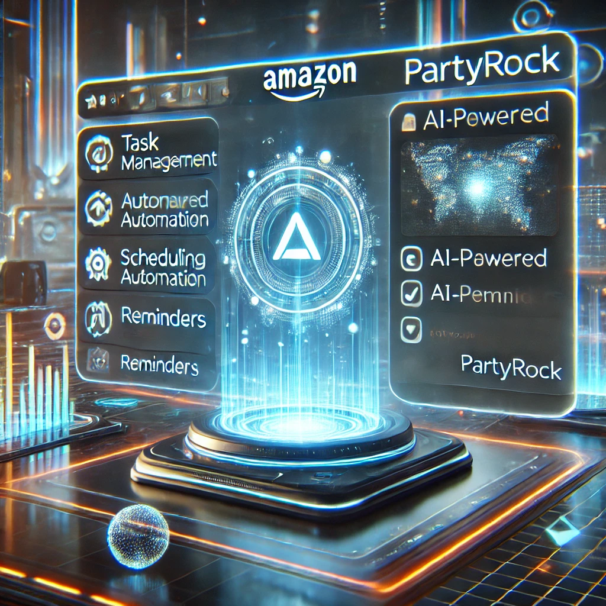

# 🚀 Aplicación de Programación de Tareas Diarias con Amazon PartyRock

## 📝 Descripción del Proyecto
En este emocionante proyecto, desarrollaremos una **Aplicación de Programación de Tareas Diarias** utilizando **Amazon PartyRock**. 🎯 Esta aplicación está diseñada para mejorar nuestra **productividad y organización diaria** a través de la IA generativa. 🧠✨

**¿Qué es Amazon PartyRock?**  
Es una plataforma de **AWS** que permite crear aplicaciones de manera sencilla con tecnologías de **inteligencia artificial**, eliminando la complejidad de la programación tradicional. 🛠️🤖

## 🎯 Objetivo de Aprendizaje
Aprenderemos a utilizar **Amazon PartyRock** para desarrollar una aplicación que facilite la gestión de tareas diarias de manera eficiente. Exploraremos **todo el proceso de creación, personalización y despliegue** de la aplicación. 🚀

## 📌 Pasos del Proyecto

### 📌 1.1 Visión General del Proyecto
Revisaremos los objetivos principales del proyecto, los beneficios de utilizar **Amazon PartyRock** y su impacto en nuestra productividad. 🏆

### 🚀 1.2 Introducción a PartyRock
Exploraremos los conceptos básicos de **Amazon PartyRock**, su funcionalidad y cómo facilita la creación de aplicaciones con IA generativa. 🔍

### ⚡ 1.3A Generación de la Aplicación de Programación de Tareas
Usaremos **PartyRock** para generar una aplicación funcional de programación de tareas diarias. Configuraremos los elementos básicos de la aplicación y aprovecharemos las capacidades de IA. 🤖✅

### 🔧 1.3B Modificación de Widgets Existentes
Personalizaremos la aplicación ajustando los widgets preexistentes en **PartyRock** para mejorar la experiencia de usuario. 🎨

### 🛠️ 1.3C Agregar Nuevos Widgets
Aprenderemos a agregar nuevos widgets para mejorar las funcionalidades y enriquecer la experiencia del usuario. ✨

### 🌍 1.3D Publicación de la Aplicación
Desplegaremos y compartiremos nuestra aplicación con otros usuarios. 📲

### 🧐 1.4 Importancia de un Prompt Detallado
Veremos cómo un prompt bien estructurado puede mejorar la generación de contenido y optimizar los resultados dentro de **PartyRock**. 🎯

### ✅ 1.5 Conclusión y Limpieza del Proyecto
Repasaremos los aprendizajes obtenidos, discutiremos la importancia de la automatización de tareas y limpiaremos los recursos utilizados para evitar costos innecesarios. 🧹

## ⚙️ Requisitos Previos
- 🔹 Cuenta de **AWS** activa.
- 🔹 Acceso a **Amazon PartyRock**.
- 🔹 Conocimientos básicos de productividad y gestión de tareas.

## 📚 Recursos Adicionales
- 📖 [Documentación oficial de Amazon PartyRock](https://aws.amazon.com/partyrock/)
- 📖 [Video cómo abrir tu cuenta AWS gratuita](https://youtu.be/zsUu33c8e84?si=SzKWvjR3Dzdu2aHX)
- 🆓 [AWS Free Tier](https://aws.amazon.com/free/)
- 🤖 [Guía de introducción a IA generativa](https://aws.amazon.com/what-is/generative-ai/)

---

## 🤝 ¡Conéctate conmigo!
🌟 **YouTube:** [CloudOps Guild](https://www.youtube.com/@CloudOpsGuildCommunity)  
✍️ **Medium:** [@marioserranopineda](https://medium.com/@marioserranopineda)  
💼 **LinkedIn:** [Mario Serrano](https://www.linkedin.com/in/mario-rodrigo-serrano-pineda/)

## 📢 ¡Síguenos en nuestras redes!
📝 **Blog CloudOpsGuild:** [Blog](https://cloudopsguild.com/blog/)  
💼 **LinkedIn CloudOpsGuild:** [CloudOps Guild](https://www.linkedin.com/company/cloudopsguild/)  
📅 **MeetUp:** [Grupo MeetUp AWS Cartagena Community](https://www.meetup.com/es-ES/aws-colombia-cartagena/)  
📘 **Facebook:** [AWS Cartagena Community](https://www.facebook.com/aws.cartagena/)  

---

## 📝 Licencia
Este proyecto está bajo la licencia **MIT**. Puedes consultar los detalles en el archivo **LICENSE**. 📜
